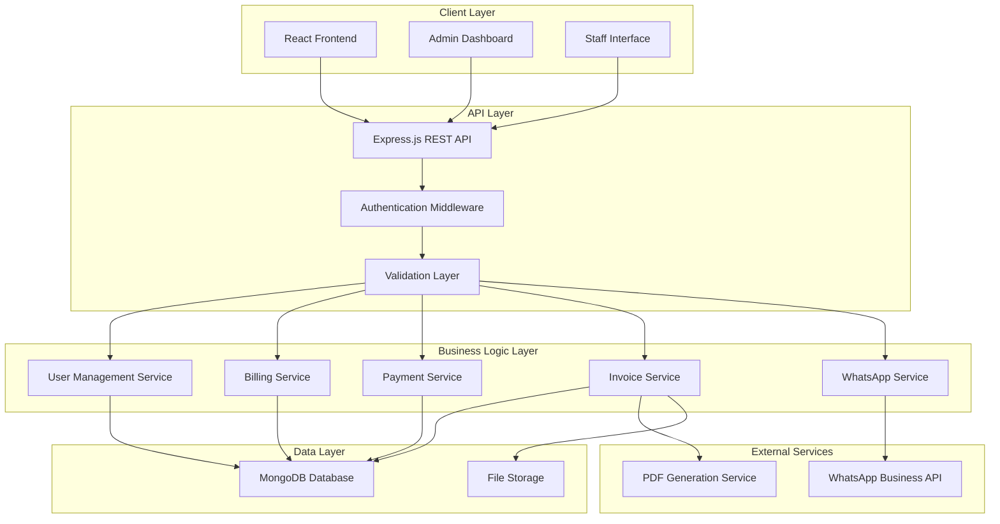
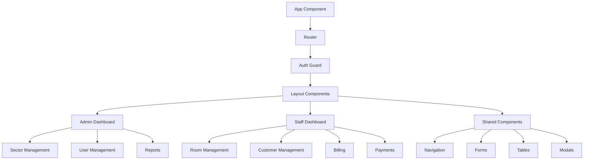

# Design Document

## Overview

The Water Collection Invoice System is a production-grade web application built with a modern tech stack to provide comprehensive billing management for housing societies, hostels, and commercial properties. The system follows a three-tier architecture with React frontend, Node.js/Express backend, and MongoDB database, integrated with WhatsApp Business API for automated invoice delivery.

The design emphasizes professional UI/UX with neutral colors, fast workflows, and enterprise-grade reliability. The system supports role-based access control, automated billing cycles, payment processing, and comprehensive reporting capabilities.

## Architecture

### System Architecture

The system follows a layered architecture pattern with clear separation of concerns:



### Technology Stack

**Frontend:**
- React 18 with functional components and hooks
- Material-UI (MUI) for professional component library
- React Router for navigation
- Axios for API communication
- React Query for state management and caching
- Formik with Yup for form handling and validation

**Backend:**
- Node.js with Express.js framework
- JWT for authentication and session management
- Mongoose for MongoDB object modeling
- Multer for file upload handling
- Node-cron for scheduled tasks
- Express-validator for input validation
- Helmet for security headers

**Database:**
- MongoDB with Mongoose ODM
- Single database with tenant isolation via organization field
- Compound indexes for performance optimization
- Automatic backup and replication

**External Integrations:**
- WhatsApp Business API (Meta Cloud API)
- PDF generation using Puppeteer
- File storage using local filesystem or cloud storage

## Components and Interfaces

### Frontend Component Architecture

The frontend follows a modular component architecture with clear separation between container and presentational components:



### Key Frontend Components

**Layout Components:**
- `AppLayout`: Main application shell with navigation
- `DashboardLayout`: Dashboard-specific layout with sidebar
- `AuthLayout`: Authentication pages layout

**Feature Components:**
- `SectorManagement`: CRUD operations for sectors
- `RoomManagement`: Room status and assignment management
- `CustomerManagement`: Customer information and room assignment
- `BillingDashboard`: Invoice generation and management
- `PaymentProcessing`: Payment recording and tracking
- `ReportsModule`: Analytics and reporting interface

**Shared Components:**
- `DataTable`: Reusable table with sorting, filtering, pagination
- `FormModal`: Modal wrapper for forms
- `StatusBadge`: Consistent status display
- `LoadingSpinner`: Loading state indicator
- `ErrorBoundary`: Error handling wrapper

### Backend API Structure

The backend follows RESTful API design principles with clear resource-based endpoints:

**Authentication Endpoints:**
- `POST /api/auth/login` - User authentication
- `POST /api/auth/logout` - Session termination
- `GET /api/auth/profile` - Current user profile

**Sector Management:**
- `GET /api/sectors` - List all sectors
- `POST /api/sectors` - Create new sector
- `PUT /api/sectors/:id` - Update sector
- `DELETE /api/sectors/:id` - Delete sector

**Room Management:**
- `GET /api/rooms` - List rooms with filters
- `POST /api/rooms` - Create new room
- `PUT /api/rooms/:id` - Update room details
- `PUT /api/rooms/:id/status` - Update room status

**Customer Management:**
- `GET /api/customers` - List customers
- `POST /api/customers` - Create customer
- `PUT /api/customers/:id` - Update customer
- `DELETE /api/customers/:id` - Remove customer

**Billing and Invoices:**
- `POST /api/invoices/generate` - Generate monthly invoices
- `GET /api/invoices` - List invoices with filters
- `GET /api/invoices/:id` - Get invoice details
- `POST /api/invoices/:id/send` - Send invoice via WhatsApp

**Payment Processing:**
- `POST /api/payments` - Record new payment
- `GET /api/payments` - List payments
- `PUT /api/payments/:id` - Update payment details

**Reporting:**
- `GET /api/reports/dashboard` - Dashboard metrics
- `GET /api/reports/collections` - Collection reports
- `GET /api/reports/occupancy` - Occupancy statistics

## Data Models

### MongoDB Schema Design

The system uses a single database with document-based schemas optimized for the application's access patterns:

**User Schema:**
```javascript
{
  _id: ObjectId,
  username: String, // unique
  email: String, // unique
  password: String, // hashed
  role: String, // 'admin', 'staff', 'customer'
  profile: {
    firstName: String,
    lastName: String,
    phone: String,
    whatsappNumber: String
  },
  organizationId: ObjectId, // for multi-tenancy
  isActive: Boolean,
  createdAt: Date,
  updatedAt: Date
}
```

**Sector Schema:**
```javascript
{
  _id: ObjectId,
  name: String,
  description: String,
  organizationId: ObjectId,
  metadata: {
    totalRooms: Number,
    occupiedRooms: Number,
    vacantRooms: Number
  },
  createdAt: Date,
  updatedAt: Date
}
```

**Room Schema:**
```javascript
{
  _id: ObjectId,
  roomNumber: String,
  sectorId: ObjectId,
  status: String, // 'Rented', 'Vacant', 'Closed', 'Unsold'
  customerId: ObjectId, // nullable
  billingConfig: {
    monthlyRate: Number,
    waterCharges: Number,
    additionalCharges: [{
      name: String,
      amount: Number
    }]
  },
  organizationId: ObjectId,
  createdAt: Date,
  updatedAt: Date
}
```

**Customer Schema:**
```javascript
{
  _id: ObjectId,
  firstName: String,
  lastName: String,
  email: String,
  phone: String,
  whatsappNumber: String,
  roomId: ObjectId,
  address: {
    street: String,
    city: String,
    state: String,
    zipCode: String
  },
  organizationId: ObjectId,
  isActive: Boolean,
  createdAt: Date,
  updatedAt: Date
}
```

**Invoice Schema:**
```javascript
{
  _id: ObjectId,
  invoiceNumber: String, // unique, auto-generated
  customerId: ObjectId,
  roomId: ObjectId,
  billingPeriod: {
    month: Number,
    year: Number
  },
  charges: {
    waterCharges: Number,
    additionalCharges: [{
      name: String,
      amount: Number
    }],
    totalAmount: Number
  },
  dueDate: Date,
  status: String, // 'Generated', 'Sent', 'Paid', 'Overdue', 'Failed'
  whatsappStatus: {
    sent: Boolean,
    sentAt: Date,
    deliveryStatus: String,
    errorMessage: String
  },
  organizationId: ObjectId,
  createdAt: Date,
  updatedAt: Date
}
```

**Payment Schema:**
```javascript
{
  _id: ObjectId,
  invoiceId: ObjectId,
  customerId: ObjectId,
  amount: Number,
  paymentMethod: String, // 'Cash', 'UPI', 'Bank Transfer'
  paymentDetails: {
    transactionId: String, // for UPI/Bank
    bankReference: String, // for Bank Transfer
    receivedBy: ObjectId // staff user ID
  },
  receiptNumber: String, // unique, auto-generated
  paymentDate: Date,
  organizationId: ObjectId,
  createdAt: Date,
  updatedAt: Date
}
```

### Database Indexes

**Performance Optimization Indexes:**
```javascript
// User collection
{ "username": 1, "organizationId": 1 } // unique
{ "email": 1, "organizationId": 1 } // unique
{ "organizationId": 1, "role": 1 }

// Room collection
{ "sectorId": 1, "status": 1 }
{ "customerId": 1 } // sparse index
{ "organizationId": 1, "roomNumber": 1 } // unique

// Invoice collection
{ "customerId": 1, "billingPeriod.month": 1, "billingPeriod.year": 1 }
{ "organizationId": 1, "status": 1 }
{ "invoiceNumber": 1 } // unique

// Payment collection
{ "invoiceId": 1 }
{ "customerId": 1, "paymentDate": -1 }
{ "organizationId": 1, "paymentDate": -1 }
```

## User Interface Design

### Design System

**Color Palette:**
- Primary: #2563eb (Professional Blue)
- Secondary: #64748b (Slate Gray)
- Success: #059669 (Green)
- Warning: #d97706 (Amber)
- Error: #dc2626 (Red)
- Background: #f8fafc (Light Gray)
- Surface: #ffffff (White)
- Text Primary: #1e293b (Dark Slate)
- Text Secondary: #64748b (Medium Slate)

**Typography:**
- Font Family: Inter, system-ui, sans-serif
- Headings: 600 weight, appropriate scale
- Body Text: 400 weight, 16px base size
- Small Text: 400 weight, 14px size

**Spacing System:**
- Base unit: 4px
- Common spacings: 8px, 12px, 16px, 24px, 32px, 48px

### Layout Patterns

**Dashboard Layout:**
- Fixed sidebar navigation (240px width)
- Top header with user profile and notifications
- Main content area with breadcrumbs
- Responsive design for tablet and desktop

**Form Layout:**
- Modal-based forms for create/edit operations
- Inline validation with clear error messages
- Consistent button placement and styling
- Auto-save for draft states

**Table Layout:**
- Sortable columns with clear indicators
- Pagination with configurable page sizes
- Bulk actions for multiple selections
- Export functionality for reports

### User Experience Patterns

**Navigation:**
- Role-based menu items
- Active state indicators
- Breadcrumb navigation for deep pages
- Quick search functionality

**Feedback:**
- Loading states for all async operations
- Success/error toast notifications
- Confirmation dialogs for destructive actions
- Progress indicators for multi-step processes

**Data Entry:**
- Auto-complete for customer selection
- Date pickers for billing periods
- Number formatting for currency fields
- Validation feedback in real-time

## Correctness Properties

*A property is a characteristic or behavior that should hold true across all valid executions of a system—essentially, a formal statement about what the system should do. Properties serve as the bridge between human-readable specifications and machine-verifiable correctness guarantees.*

### Property 1: Authentication Round-Trip Consistency
*For any* valid user credentials, successful authentication should create a session that, when used to access protected resources, provides the correct role-based permissions for that user.
**Validates: Requirements 1.1, 1.2**

### Property 2: Data Persistence Round-Trip
*For any* valid entity (sector, room, customer, payment), creating the entity and then retrieving it should return equivalent data with all required fields preserved.
**Validates: Requirements 2.1, 4.1, 5.1**

### Property 3: Room-Customer Assignment Consistency
*For any* room and customer assignment operation, the room status should always reflect the current customer assignment state (Rented when customer assigned, Vacant when customer removed).
**Validates: Requirements 3.3, 4.3, 4.4**

### Property 4: Invoice Generation Business Rules
*For any* billing period and room set, invoice generation should create invoices only for rooms with "Rented" status and never create duplicate invoices for the same room and month combination.
**Validates: Requirements 6.1, 6.2**

### Property 5: Invoice Calculation Accuracy
*For any* room with billing configuration, the generated invoice total should equal the sum of all configured charges (water charges plus additional charges) for that room.
**Validates: Requirements 6.3**

### Property 6: Payment Processing Integrity
*For any* valid payment against an invoice, recording the payment should update the invoice status to "Paid" and prevent any subsequent payments for the same invoice.
**Validates: Requirements 5.2, 5.3**

### Property 7: WhatsApp Delivery Status Consistency
*For any* invoice with WhatsApp delivery attempt, the invoice status should accurately reflect the delivery outcome (Sent for success, Failed for errors) and include appropriate error logging for failures.
**Validates: Requirements 7.1, 7.2, 7.3**

### Property 8: Referential Integrity Preservation
*For any* database operation involving related entities (customer-room, room-sector, invoice-customer), the system should maintain referential integrity and prevent orphaned records or invalid relationships.
**Validates: Requirements 2.3, 9.3**

### Property 9: Dashboard Calculation Accuracy
*For any* system state, dashboard metrics (total revenue, pending payments, collection rates) should accurately reflect the current sum of all relevant financial transactions and invoice statuses.
**Validates: Requirements 8.1**

### Property 10: Duplicate Prevention Enforcement
*For any* attempt to create duplicate records (same room-month invoice, multiple customers per room, duplicate payments), the system should prevent creation and maintain data consistency.
**Validates: Requirements 4.2, 6.2, 9.2**

## Error Handling

### Error Categories and Responses

**Validation Errors (400 Bad Request):**
- Invalid input formats (email, phone numbers, dates)
- Missing required fields
- Business rule violations (duplicate assignments, invalid status transitions)
- Response format: `{ "error": "validation", "message": "Descriptive error", "field": "fieldName" }`

**Authentication Errors (401 Unauthorized):**
- Invalid credentials
- Expired sessions
- Insufficient permissions for role-based access
- Response format: `{ "error": "authentication", "message": "Authentication required" }`

**Authorization Errors (403 Forbidden):**
- Role-based access violations
- Attempting operations outside user permissions
- Response format: `{ "error": "authorization", "message": "Insufficient permissions" }`

**Resource Errors (404 Not Found):**
- Requested entities not found
- Invalid resource identifiers
- Response format: `{ "error": "not_found", "message": "Resource not found", "resource": "resourceType" }`

**Conflict Errors (409 Conflict):**
- Duplicate record creation attempts
- Concurrent modification conflicts
- Business rule violations (deleting sector with rooms)
- Response format: `{ "error": "conflict", "message": "Operation conflicts with current state" }`

**External Service Errors (502 Bad Gateway):**
- WhatsApp API failures
- PDF generation service errors
- Database connection issues
- Response format: `{ "error": "service_unavailable", "message": "External service error", "retry": true }`

### Error Recovery Strategies

**Automatic Retry Logic:**
- WhatsApp message delivery failures: 3 retry attempts with exponential backoff
- Database connection errors: Connection pool management with automatic reconnection
- PDF generation failures: Retry with fallback to simplified template

**Graceful Degradation:**
- WhatsApp service unavailable: Mark invoices as "Pending Delivery" for manual retry
- PDF generation failure: Generate text-based invoice format
- Database read failures: Display cached data with staleness indicator

**User Feedback:**
- Real-time validation feedback during form input
- Clear error messages with suggested corrective actions
- Progress indicators for long-running operations (bulk invoice generation)
- Toast notifications for operation success/failure

## Testing Strategy

### Dual Testing Approach

The system employs both unit testing and property-based testing to ensure comprehensive coverage:

**Unit Tests:**
- Specific examples and edge cases for individual functions
- Integration points between components
- Error conditions and boundary cases
- Mock external services (WhatsApp API, PDF generation)

**Property-Based Tests:**
- Universal properties that hold across all inputs
- Business rule enforcement across randomized data
- Data integrity validation with generated test cases
- Comprehensive input coverage through randomization

### Property-Based Testing Configuration

**Testing Framework:** 
- Backend: `fast-check` library for Node.js property-based testing
- Frontend: `@fast-check/jest` for React component property testing
- Minimum 100 iterations per property test to ensure thorough coverage

**Test Organization:**
Each correctness property maps to specific property-based tests with clear tagging:

```javascript
// Example property test structure
describe('Invoice Generation Properties', () => {
  it('Property 4: Invoice generation business rules', () => {
    // Tag: Feature: water-collection-invoice-system, Property 4: Invoice generation business rules
    fc.assert(fc.property(
      roomGenerator(),
      billingPeriodGenerator(),
      (rooms, period) => {
        const invoices = generateInvoices(rooms, period);
        // Test that only rented rooms get invoices
        // Test no duplicate invoices for same room-month
      }
    ), { numRuns: 100 });
  });
});
```

**Test Data Generators:**
- Room generators with various statuses and configurations
- Customer generators with valid/invalid data patterns
- Payment generators with different methods and amounts
- Invoice generators with various billing scenarios

### Integration Testing

**API Integration Tests:**
- End-to-end workflow testing (customer creation → room assignment → invoice generation → payment)
- Authentication and authorization flow validation
- External service integration testing with mock services

**Database Integration Tests:**
- Transaction integrity testing
- Concurrent operation handling
- Data migration and schema validation

**Frontend Integration Tests:**
- User workflow testing with React Testing Library
- Form submission and validation flows
- Navigation and routing behavior

### Performance Testing

**Load Testing:**
- Concurrent user simulation for peak usage scenarios
- Database query performance under load
- API response time validation (< 3 second requirement)

**Stress Testing:**
- Large dataset handling (thousands of rooms and customers)
- Bulk invoice generation performance
- Memory usage optimization validation

### Security Testing

**Authentication Security:**
- JWT token validation and expiration handling
- Password hashing and storage security
- Session management security

**Input Validation Security:**
- SQL injection prevention (NoSQL injection for MongoDB)
- XSS prevention in frontend inputs
- CSRF protection for state-changing operations

**Data Privacy:**
- Customer data access control validation
- Audit trail completeness testing
- Data encryption in transit and at rest